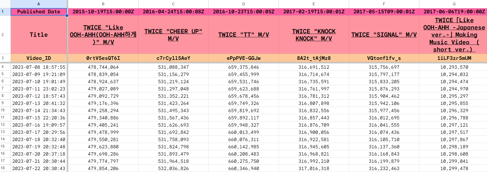
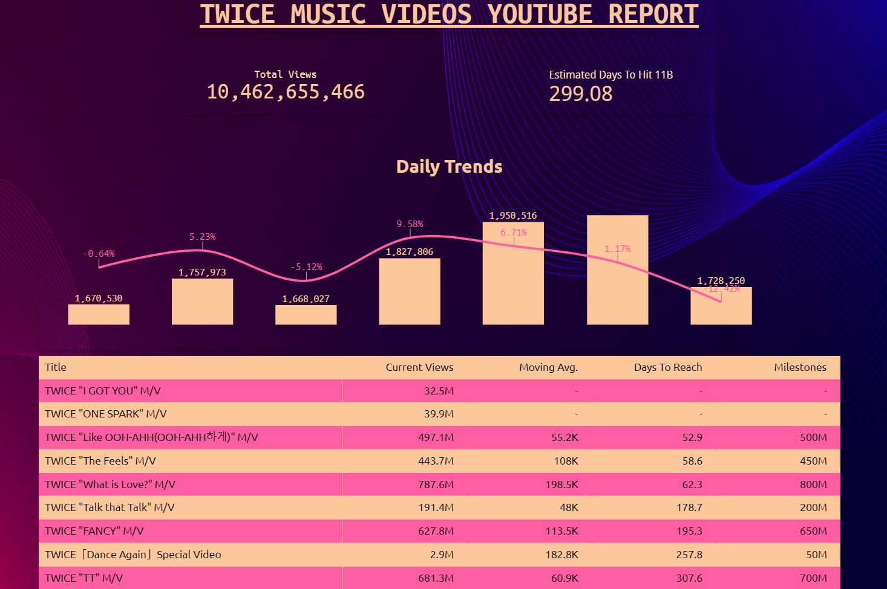
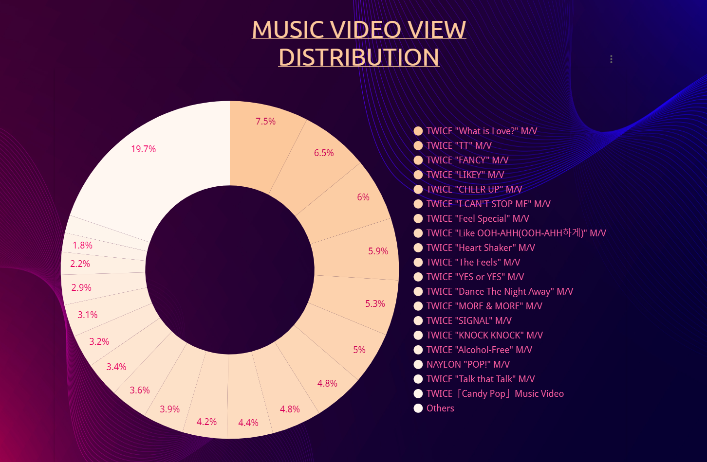

# Twice MV Views Tracker

A project to track and analyze YouTube views for Twice's music videos.

## Overview

This project uses the YouTube API to fetch daily view counts for Twice's MVs and stores the data in Google Sheets. The data is visualized using Looker Studio.

## Project Structure

- `scripts/`: Python scripts for data collection and updating Google Sheets.
- `screenshots/`: Contains screenshots of the dashboard and other relevant visuals.

## Setup

1. Clone the repository:
    ```bash
    git clone https://github.com/yourusername/twice-mv-views-tracker.git
    cd twice-mv-views-tracker
    ```

2. Install the required dependencies:
    ```bash
    pip install -r requirements.txt
    ```

3. Set up your Google Cloud credentials and YouTube API key.

## Usage

- Run `script.py` to fetch the latest views and update Google sheet:
    ```bash
    python scripts/fetch_views.py
    ```


## Dashboard

The Looker Studio dashboard provides visual insights into the view counts. Below are some screenshots of the dashboard:

### Screenshot 1: Overview of All MVs


### Screenshot 2: Most Viewed MV


### Screenshot 3: Weekly Trend Graph


## Contribution

Contributions are welcome! Please fork this repository, make your changes, and submit a pull request.

## License

This project is licensed under the MIT License - see the [LICENSE](LICENSE) file for details.
